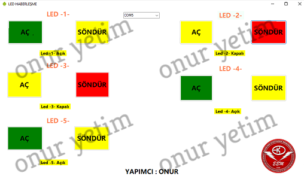
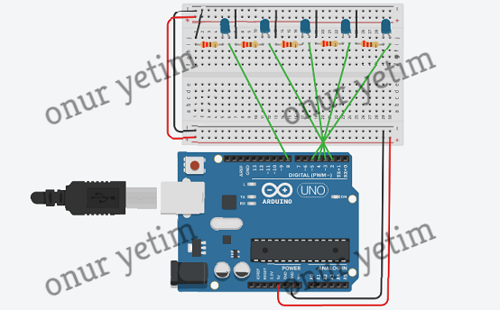
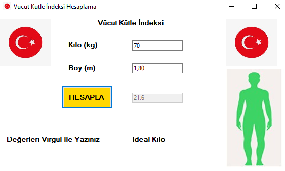

## PROJECTS

- SMART CLEANING ROBOT
- LI-ION / LI-PO CHARGING AND TRACKING SYSTEM
- SOLAR TRACKING - LI-ION / LI-PO CHARGING AND TRACKING SYSTEM
- SMART COMBI AUTOMATION
- LED COMMUNICATION
- BMI 

## SMART CLEANING ROBOT

- Gümüşhane University
- Design Project

WEB PAGE 1

WEB PAGE 2

## LI-ION / LI-PO CHARGING AND TRACKING SYSTEM

- Gümüşhane University
- Bachelor Thesis
- Project Partner: Mert Can Tıkman

MENU DESIGN 

COMPUTER INTERFACE

MOBILE APP 

## SOLAR TRACKING - LI-ION / LI-PO CHARGING AND TRACKING SYSTEM

## SMART COMBI AUTOMATION 

- Hobby Project

## LED COMMUNICATION 

- Hobby Project

CONNECTION DIAGRAM

## BMI

- Hobby Project

