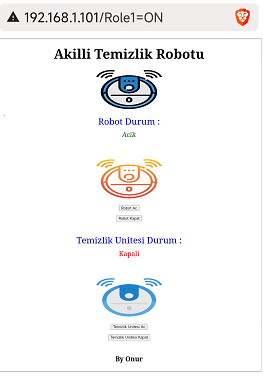
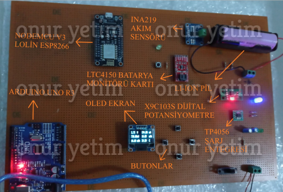

## MADE WORKS 

- SMART CLEANING ROBOT
- LI-ION / LI-PO CHARGING AND TRACKING SYSTEM
- DC MOTOR DRIVER 
- SMART COMBI AUTOMATION
- HC-05 RELAY LED CONTROLLER
- LED COMMUNICATION 

## SMART CLEANING ROBOT

- Gümüşhane University
- Design Project

MOBILE APP 

## LI-ION / LI-PO CHARGING AND TRACKING SYSTEM

- Gümüşhane University
- Bachelor Thesis
- Project Partner: Mert Can Tıkman

MENU DESIGN 

COMPUTER INTERFACE

MOBILE APP 

## DC MOTOR DRIVER

- Hobby Project

CIRCUIT

PCB 

## SMART COMBI AUTOMATION 

- Hobby Project

## HC-05 LED CONTROLLER

- Hobby Project
 

MOBILE APP 
 

## LED COMMUNICATION 

- Hobby Project

CONNECTION DIAGRAM

## BLACK-LIGHTNING

- Hobby Project

