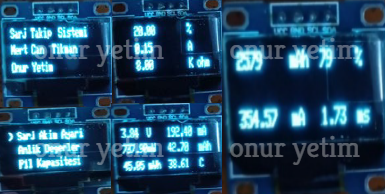
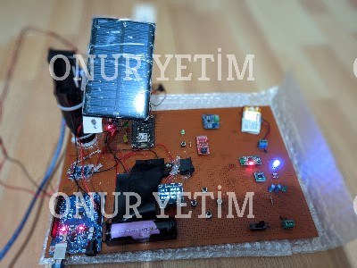

## PROJECTS

- SMART CLEANING ROBOT
- LI-ION / LI-PO CHARGING AND TRACKING SYSTEM
- SOLAR TRACKING - LI-ION / LI-PO CHARGING AND TRACKING SYSTEM
- IR REMOTE RGB LED CONTROLLER FOR RASPBERRY Pİ PİCO
- SMART COMBI AUTOMATION
- LED COMMUNICATION

## SMART CLEANING ROBOT

- Gümüşhane University
- Design Project

WEB PAGE 1

WEB PAGE 2

## LI-ION / LI-PO CHARGING AND TRACKING SYSTEM

- Gümüşhane University
- Bachelor Thesis
- Project Partner: Mert Can Tıkman

MENU DESIGN 

COMPUTER INTERFACE

MOBILE APP 

## SOLAR TRACKING - LI-ION / LI-PO CHARGING AND TRACKING SYSTEM

## IR REMOTE RGB LED CONTROLLER FOR RASPBERRY Pİ PİCO

## SMART COMBI AUTOMATION 

v2.0

## LED COMMUNICATION 

CONNECTION DIAGRAM

